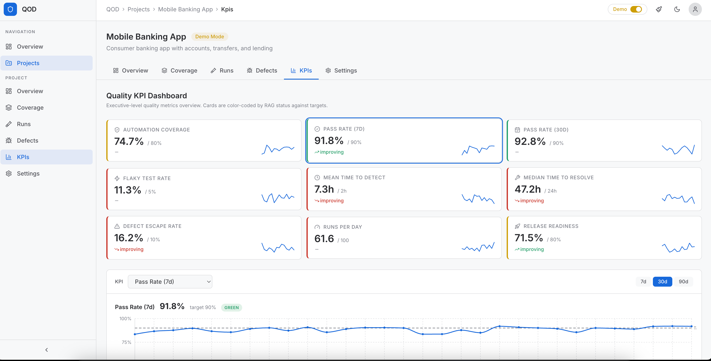

# QOD - Quality Observability Dashboard

A self-hosted, open quality metrics platform that aggregates data from the tools engineering teams already use (GitHub Actions, Jira, TestRail, JUnit/TestNG reports) into a single observable surface.

Built for QA Managers, SDETs, Engineering Managers, and Developers who need a single source of truth for quality KPIs across projects.



## Quick Start (Docker — Recommended)

Start the full stack (PostgreSQL, Redis, API, Web) with one command:

```bash
git clone <repo-url> && cd qod

# Build and start all services
cd deploy/docker-compose && docker compose up --build -d
```

That's it. Open **http://localhost:3000**. The API auto-runs Prisma migrations and seeds the database on first start.

#### Dev Override

To expose PostgreSQL (5432) and Redis (6379) ports to the host for local debugging or direct DB access, add the dev override file:

```bash
cd deploy/docker-compose
docker compose -f docker-compose.yml -f docker-compose.dev.yml up --build -d
```

## Features

### Dashboard Modules

**KPI Dashboard** (`/projects/[id]/kpis`)
- 9 KPI metrics with RAG status (green/amber/red), sparklines, and trend arrows
- Configurable thresholds per project
- Detailed trend chart with 7d/30d/90d period selection
- Metrics: Coverage %, Pass Rate (7d/30d), Flaky Rate, MTTD, MTTR, Escape Rate, Execution Velocity, Release Readiness Score

**Test Coverage** (`/projects/[id]/coverage`)
- Automation coverage ratio (automated vs manual)
- Coverage heatmap by feature area
- Never-run test detection
- Test case table with filtering (suite, type, references), sorting, pagination
- **Stories tab**: Jira stories with status, points, assignee, component, labels
- **Epic Coverage tab**: drill-down from Epic → Stories → Test Cases. Epics show story coverage %, automation %, and test case counts. Click an epic to expand its stories, click a story to see linked test cases with execution history
- Epic/story filters: search, status, coverage (has TCs / no TCs)
- **Test history side-drawer**: click any test case to see its pass/fail execution trend, stats summary, and full execution history

**Automation Execution** (`/projects/[id]/runs`)
- Pass rate trend chart
- Execution volume timeline (passed/failed/skipped)
- Flaky test detection with flakiness scoring and inline test history drill-down
- **Re-run analysis**: re-run rate, original vs masked failure rate, daily re-run breakdown chart
- Run history with branch, environment, trigger type filters
- CI/CD pipeline run tracking

**Defect Analytics** (`/projects/[id]/defects`)
- **MTTD/MTTR computation**: average and median time-to-detect and time-to-resolve
- **MTTR by severity**: breakdown table showing resolution time per severity level
- **MTTR weekly trend**: line chart showing resolution time improving over time
- Defect inflow vs resolution trend
- Severity breakdown (donut chart)
- Open defect age distribution
- Escaped defect tracking
- Full defect table with severity-colored indicators

**Project Overview** (`/projects/[id]`)
- Key metrics summary (pass rate, coverage, open defects)
- Recent run activity
- **Export**: Connector configuration export/import (JSON) for backup and cross-project transfer

**Settings** (`/projects/[id]/settings`)
- Connector configuration (credentials, field mapping, sync schedule)
- Connector export/import (JSON) for backup and cross-project transfer
- KPI threshold editor with live RAG preview
- Data retention and demo mode controls

### Connectors

| Connector | Type | Auth | Data Ingested |
|-----------|------|------|---------------|
| GitHub Actions | CI | PAT / GitHub App | Workflow runs, jobs, steps, commit metadata |
| TestRail | TMS | API Key | Test cases, runs, results, suites |
| Jira Defects | Issue Tracker | API Token | Defects via JQL, changelog, state transitions |
| Jira Stories | Issue Tracker | API Token | Stories, Epics, story points, parent epic linkage |
| JUnit XML | Report Upload | N/A | Test results from XML reports |
| TestNG XML | Report Upload | N/A | Test results from TestNG XML reports |

All connectors implement the `IQODConnector` plugin interface. New connectors can be added without touching core code.

### Demo Mode

When no connectors are configured (or `demoMode` is enabled on a project), QOD generates deterministic artificial data:

- 3 sample projects with distinct characteristics (E-Commerce, Banking, Internal Tools)
- 910+ test cases across 10 feature areas per project
- ~360 test runs over 90 days with realistic pass rate trends
- ~15% of failed runs generate automatic re-runs with boosted pass rates
- 85+ defects with severity distribution, lifecycle, and changelog transitions
- All 10 KPI metrics with daily snapshots
- Per-test execution history for side-drawer drill-down
- MTTD/MTTR computation from defect changelogs
- Data is seeded (deterministic) so it's stable across page reloads

## Managing the Stack

```bash
cd deploy/docker-compose

# Check status
docker compose ps

# View logs (follow)
docker compose logs -f

# Rebuild after code changes
docker compose up --build -d

# Stop all services
docker compose down

# Full reset (stop + wipe all data)
docker compose down -v
```

> **Tip**: If using the dev override, add `-f docker-compose.yml -f docker-compose.dev.yml` to each command above, or use the npm shortcuts from the project root: `npm run docker:up`, `npm run docker:down`, `npm run docker:logs`.

### What's Running

| Container | Port | Description |
|-----------|------|-------------|
| **postgres** | 5432 | TimescaleDB (PostgreSQL 16) with health checks |
| **redis** | 6379 | Redis 7 with health checks |
| **api** | 4000 | NestJS backend — auto-migrates, health checked, Swagger at `/api/docs` |
| **web** | 3000 | Next.js frontend — waits for API to be healthy before starting |

All containers use Node 22 Alpine, `restart: unless-stopped`, and health checks.

## Demo Mode (No Backend Needed)

To explore the UI without any infrastructure:

```bash
npm install
npm run -w packages/web dev
# Open http://localhost:3000
```

The app launches in **demo mode** with 3 sample projects, 910+ test cases, 90 days of history, and all KPI metrics pre-populated.

## Local Development (API + Web without Docker)

For active development with hot reload on both frontend and backend:

```bash
# Start only PostgreSQL + Redis in Docker (dev override exposes ports to host)
cd deploy/docker-compose && docker compose -f docker-compose.yml -f docker-compose.dev.yml up postgres redis -d

# Install dependencies (from project root)
npm install

# Run database migrations
npm run db:migrate

# Start API (port 4000) and Web (port 3000) with hot reload
npx turbo dev
```

## Architecture

```
qod/
├── packages/
│   ├── api/          # NestJS + Fastify backend
│   ├── web/          # Next.js 14 frontend
│   └── shared/       # Shared types, interfaces, demo generator
├── deploy/
│   ├── docker-compose/
│   └── helm/         # Kubernetes (Phase 3)
├── docker/           # Dockerfiles
└── docs/             # Additional documentation
```

### Tech Stack

| Layer | Technology |
|-------|-----------|
| Frontend | Next.js 14 (App Router), TypeScript, Tailwind CSS, Recharts, TanStack Query |
| Backend | NestJS, Fastify, Prisma ORM, BullMQ |
| Database | PostgreSQL 16 + TimescaleDB |
| Cache/Queue | Redis 7 |
| Auth | JWT (HS256), RBAC (Admin/Member/Viewer) |
| Real-time | WebSocket (Socket.IO) via NestJS gateway |
| Testing | Vitest (550+ unit/integration tests), nock (HTTP mocking) |

### System Diagram

```
External Systems              QOD Backend                    QOD Frontend
─────────────────    ─────────────────────────────    ──────────────────
GitHub Actions ──┐   ┌─ Webhook Receiver            Next.js 14
TestRail ────────┤   │  POST /api/v1/webhooks/*     ├─ KPI Dashboard
Jira ────────────┤──>├─ Sync Engine (BullMQ)        ├─ Coverage Module
JUnit XML ───────┤   │  Normalize + Dedupe + Upsert ├─ Execution Module
TestNG XML ──────┘   ├─ Aggregation Engine          ├─ Defect Analytics
                     │  KPI computation jobs        ├─ Test History Drawer
                     ├─ WebSocket Gateway (/live)   ├─ Re-run Analysis
                     ├─ Export Service              ├─ Settings
                     │  Connector JSON export       └─ Demo Mode
                     ├─ REST API /api/v1/*
                     └─ PostgreSQL + Redis
```

## Documentation

See the [`docs/`](docs/) folder for additional documentation:

- [API Reference](docs/api.md)
- [Configuration](docs/configuration.md)
- [Deployment](docs/deployment.md)
- [Data Model](docs/data-model.md)
- [Testing](docs/testing.md)
- [WebSocket / Real-time](docs/websocket.md)
- [Plugin Interface](docs/plugin-interface.md)
- [Roadmap](docs/roadmap.md)

## License

This project is licensed under the MIT License — see the [LICENSE](LICENSE) file for details.
